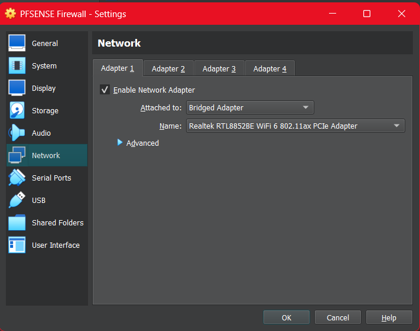
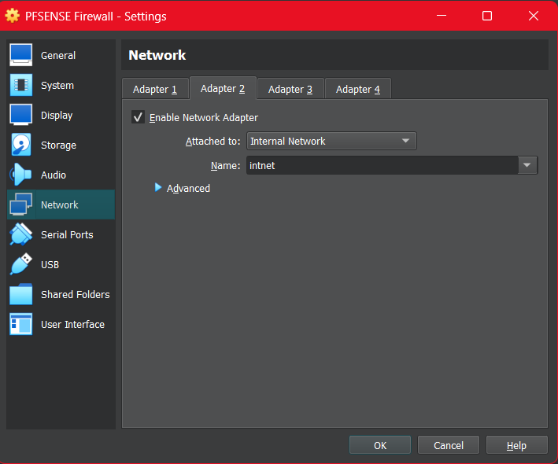
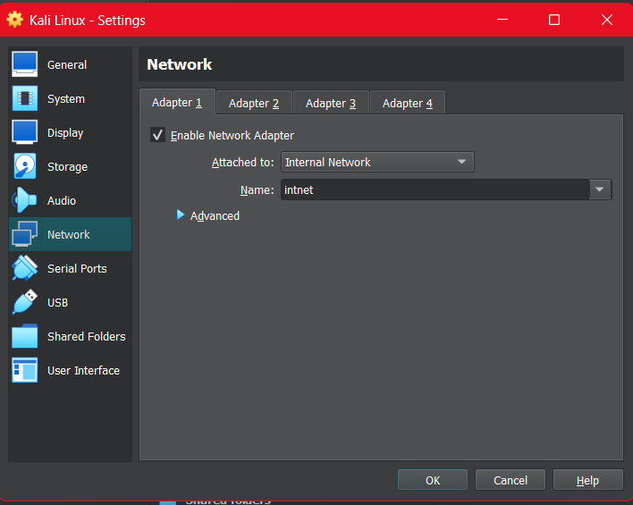
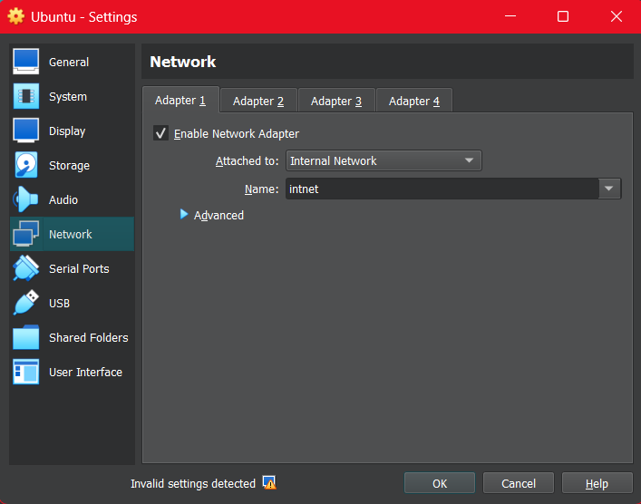
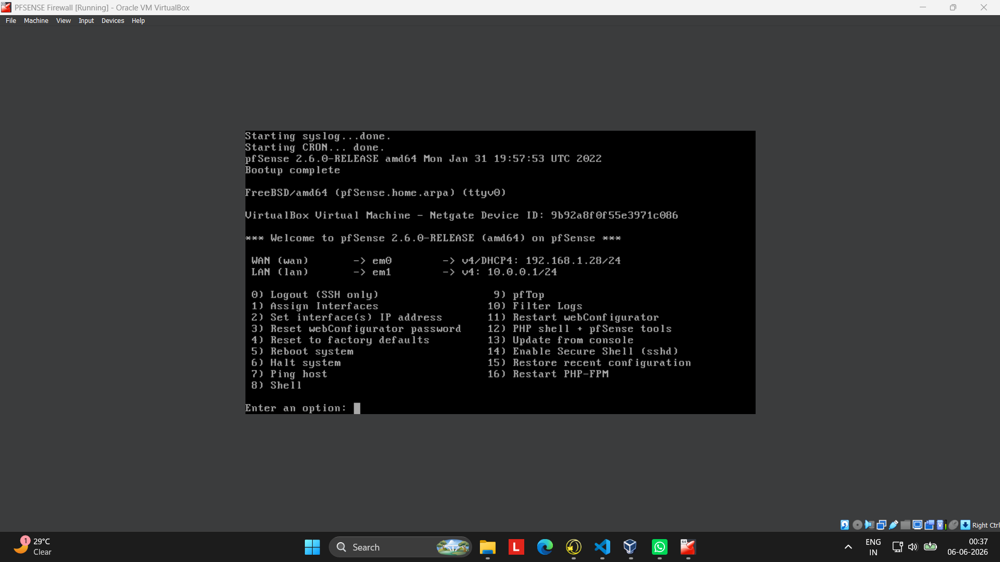

# pfSense Home Lab Setup

## Overview

This project documents the creation of a virtualized home lab environment using pfSense as a firewall and router. The lab simulates a small enterprise network and provides a foundation for learning networking, firewall administration, system configuration, and cybersecurity concepts in a safe and isolated environment.

---

## Objectives

* Deploy pfSense as a virtual firewall and router.
* Create separate WAN and LAN network segments.
* Connect multiple client machines through the firewall.
* Provide internet access to internal hosts.
* Build a reusable environment for networking and cybersecurity practice.

---

## Lab Architecture

```text
Internet
    │
    ▼
WAN Interface
    │
    ▼
pfSense Firewall
    │
    ▼
LAN Interface
    │
    ▼
Internal Virtual Network (LabNet)
├── Kali Linux
├── Ubuntu Linux
└── Additional Test Machines
```

---

## Technologies Used

* Oracle VirtualBox
  https://www.virtualbox.org/wiki/Downloads

* pfSense Community Edition
  https://archive.org/download/pfSense-CE-2.6.0-RELEASE-amd64

* Kali Linux
  https://www.kali.org/get-kali/#kali-platforms

* Ubuntu Desktop
  https://ubuntu.com/download/desktop

---

## Virtual Machine Configuration

### pfSense

#### Adapter 1 (WAN)

* Mode: Bridged Adapter
* Purpose: Internet Connectivity



#### Adapter 2 (LAN)

* Mode: Internal Network
* Network Name: LabNet



### Kali Linux

#### Adapter 1

* Mode: Internal Network
* Network Name: LabNet



### Ubuntu Linux

#### Adapter 1

* Mode: Internal Network
* Network Name: LabNet



---

## Network Configuration

### WAN Interface

* Obtains an IP address from the home router using DHCP.
* Provides internet connectivity to the lab environment.

### LAN Interface

* Configured with a private network address.
* Serves as the default gateway for internal machines.
* DHCP enabled to automatically assign addresses to clients.

Example configuration:

```text
LAN Network: 10.0.0.0/24
pfSense LAN IP: 10.0.0.1
```

---

## Deployment Process

### Step 1: Install pfSense

* Download the pfSense ISO.
* Create a new VirtualBox virtual machine.
* Attach the pfSense ISO as installation media.
* Complete the installation process.
* Reboot the virtual machine.



Reference Tutorial:

https://www.youtube.com/playlist?list=PL9Puyn_9KBpjmpB91oxl-j6_IM1mRsWLp

---

### Step 2: Configure Interfaces

Assign network adapters:

```text
WAN → Adapter 1 (Bridged Adapter)

LAN → Adapter 2 (Internal Network)
```

Verify interface assignments through the pfSense console menu.

---

### Step 3: Configure the LAN

* Assign a LAN IP address.
* Enable the DHCP server.
* Save and apply the configuration.

Example:

```text
LAN IP: 10.0.0.1/24
```

---

### Step 4: Install and Configure Kali Linux

* Create a Kali Linux virtual machine.
* Attach the Kali Linux ISO.
* Complete the installation process.
* Configure the network adapter to use the Internal Network (LabNet).
* Obtain an IP address from the pfSense DHCP server.

Verify connectivity:

```bash
ip addr
ping 10.0.0.1
ping google.com
```

---

### Step 5: Install and Configure Ubuntu Linux

* Create an Ubuntu virtual machine.
* Attach the Ubuntu ISO.
* Complete the installation process.
* Configure the network adapter to use the Internal Network (LabNet).
* Obtain an IP address from the pfSense DHCP server.

Verify connectivity:

```bash
ip addr
ping 10.0.0.1
ping google.com
```

---

### Step 6: Access the pfSense Web Interface

Open a browser on Kali Linux or Ubuntu and navigate to:

```text
https://10.0.0.1
```

Complete the setup wizard and configure administrative settings.

---

## Connectivity Testing

The following checks were performed:

* Client-to-pfSense communication.
* Client-to-client communication.
* Internet connectivity through pfSense.
* DNS resolution.

Commands used:

```bash
ip addr
ping 10.0.0.1
ping google.com
```

---

## Challenges Encountered

### Interface Assignment Confusion

Initially, the WAN and LAN adapters were assigned incorrectly, preventing internet connectivity.

**Resolution**

* Reconfigured adapter assignments.
* Verified interface mappings through the pfSense console.

### DHCP Configuration Issues

Client machines initially failed to obtain IP addresses.

**Resolution**

* Confirmed Internal Network configuration in VirtualBox.
* Verified DHCP server settings in pfSense.

---

## Lessons Learned

* Virtual network design and segmentation.
* WAN and LAN interface configuration.
* DHCP and DNS fundamentals.
* Firewall deployment and administration.
* Virtual machine networking using VirtualBox.
* Troubleshooting connectivity issues in isolated environments.

---

## Conclusion

This project successfully established a pfSense-based virtual home lab consisting of pfSense, Kali Linux, and Ubuntu Linux. The environment provides a flexible platform for learning networking, firewall administration, virtualization, and cybersecurity concepts while maintaining a safe and isolated testing environment.
